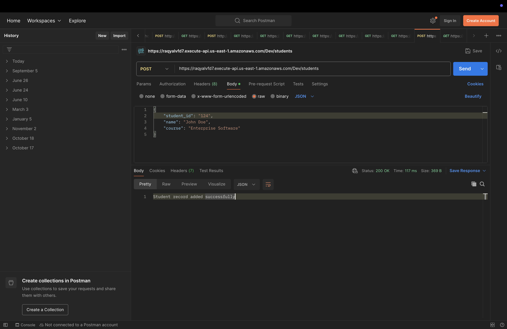
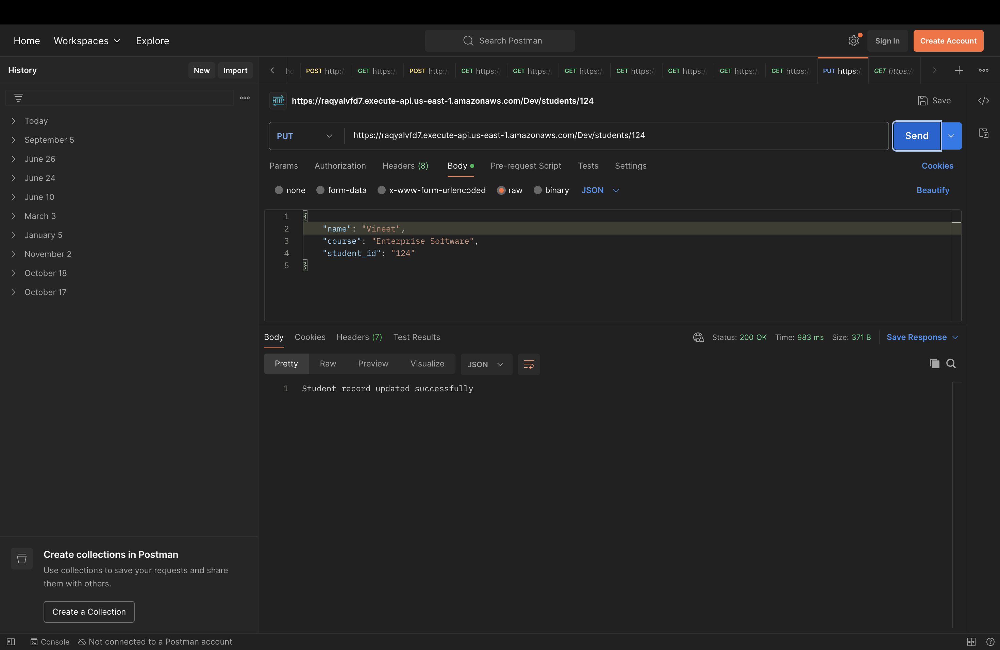
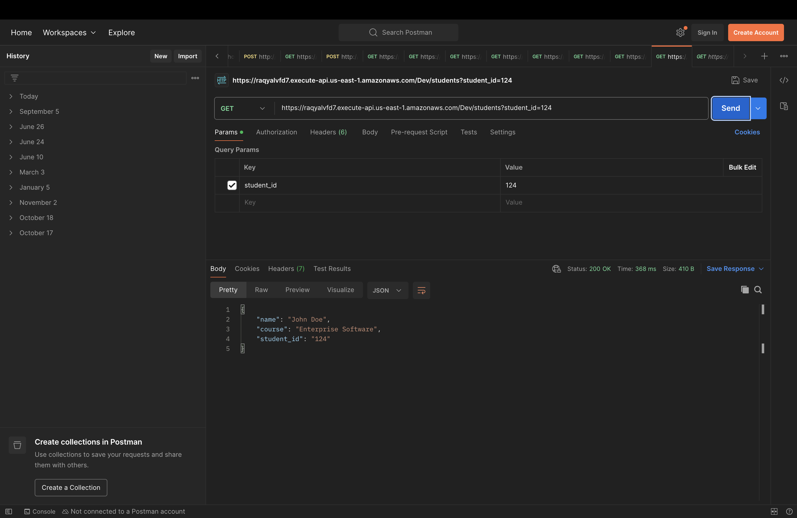
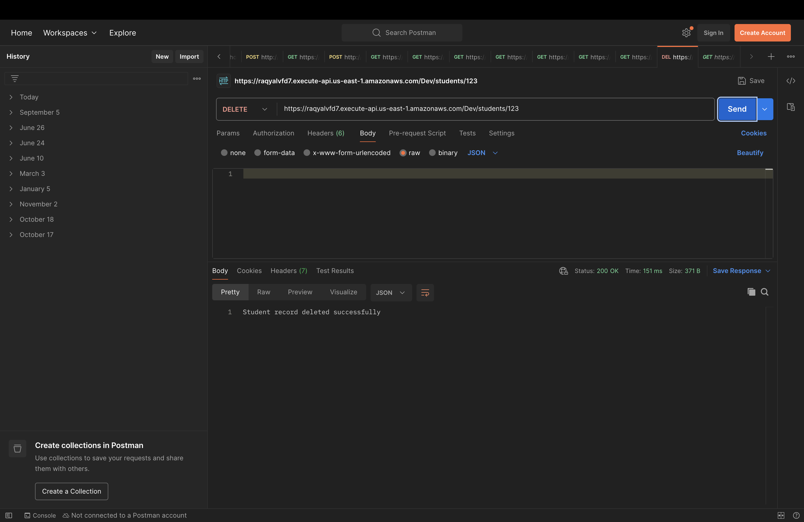
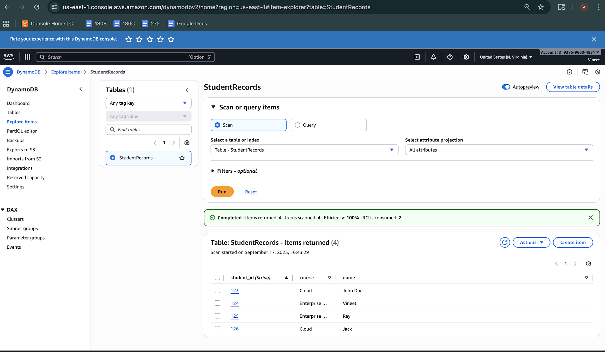

## Testing Artifacts:

### POST

### PUT

### GET

### DELETE

### DynamoDB

## Reflection

Building a small CRUD service with **AWS Lambda + API Gateway + DynamoDB** looked simple on paper, but the hands-on work surfaced a few real-world gotchas—and taught me how the pieces actually fit together.

### Challenges I faced
- **Handler & runtime wiring:** I initially saw “Hello from Lambda!” or 500s because the handler name/runtime didn’t match the uploaded code and the `TABLE_NAME` env var wasn’t set.
- **IAM permissions:** My function had only CloudWatch logging; calls to DynamoDB failed until I attached least-privilege CRUD permissions to the table ARN.
- **API Gateway proxy integration:** Methods created without **Lambda proxy** sent events without `httpMethod`, causing 405s in my handler. Recreating methods with proxy fixed it.

### What I learned
- How **Lambda proxy events** are structured (`httpMethod`, `pathParameters`, `queryStringParameters`, `body`) and how to route based on them.
- Designing **idempotent writes** and safe updates in DynamoDB using `ConditionExpression` and dynamic `UpdateExpression`.

